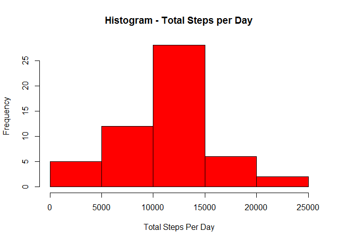
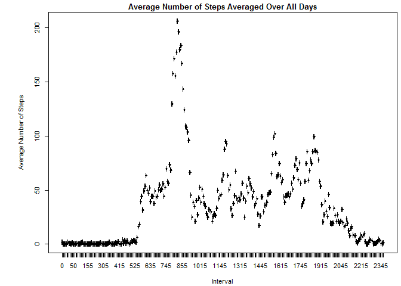
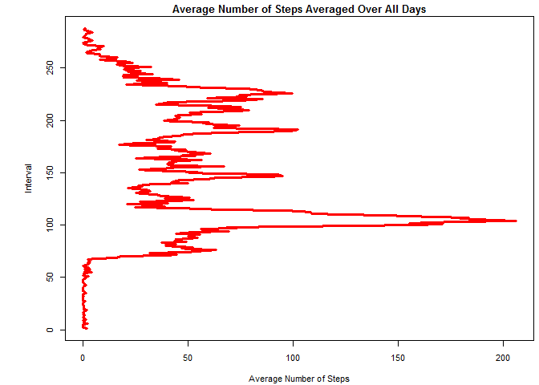
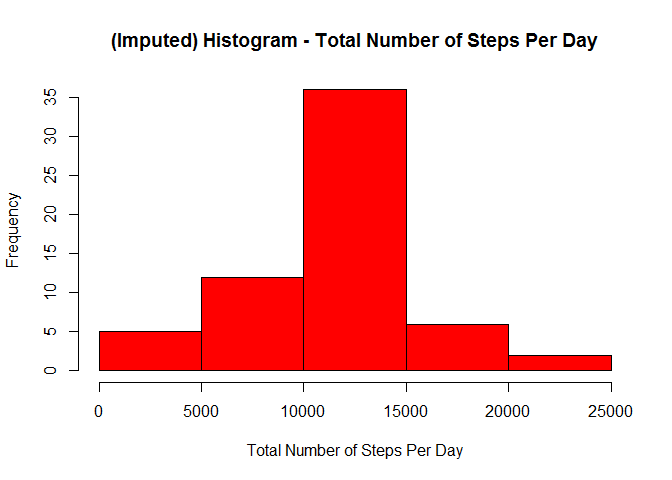
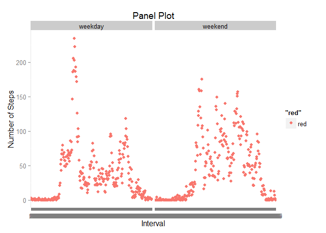
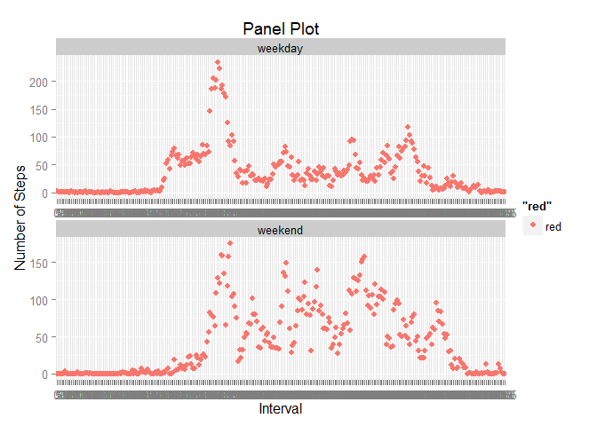

# Reproducible Research: Peer Assessment 1 - Manoj Kumar


```r
library(ggplot2)


## Loading and preprocessing the data

## Q1. Show any code that is needed to :
##  1.  Load the data (i.e. read.csv())
##  2.  Process/transform the data (if necessary) into a format suitable for your analysis


my_data <- function() {
  
  # Store dataset file name in a vector
  projfile = "activity.zip"
  
  # Store location of the dataset file in a vector
  source_url = "https://github.com/profkumar/RepData_PeerAssessment1/blob/master/activity.zip"
  
  # If dataset is not already on the computer in the working deirectory, 
  # download it firstfrom the above location and store as vector as mentioned above  
  if(!file.exists(projfile)) {
    download.file(source_url, destfile = projfile, method="curl")
  }
  
  # Unzip the available (or downloaded) zipped dataset file and store into a vector
  fileunzip <- unz(projfile, "activity.csv")
  
  # Read unzipped csv file, define classes (according to assignment details) of column in it 
  # (so that there are no mistakes)
  myfile <- read.csv(fileunzip, header = TRUE, colClasses = c("numeric", "character", "numeric"))
  
  # convert "interval" column into factors
  myfile$interval <- factor(myfile$interval)
  
  # change the date format in "date" column (i.e. YYYY-MM-DD)
  myfile$date <- as.Date(myfile$date, format = "%Y-%m-%d")
  
  # Read data
  myfile
}

# store above data frame in "myfile" data frame 
myfile <- my_data()
myfile0 <- myfile

# Although not a part of this assignment, let us have a look into the data we have just prepared
head(myfile)
```

```
##   steps       date interval
## 1    NA 2012-10-01        0
## 2    NA 2012-10-01        5
## 3    NA 2012-10-01       10
## 4    NA 2012-10-01       15
## 5    NA 2012-10-01       20
## 6    NA 2012-10-01       25
```

```r
# Structure of the dataset
str(myfile)
```

```
## 'data.frame':	17568 obs. of  3 variables:
##  $ steps   : num  NA NA NA NA NA NA NA NA NA NA ...
##  $ date    : Date, format: "2012-10-01" "2012-10-01" ...
##  $ interval: Factor w/ 288 levels "0","5","10","15",..: 1 2 3 4 5 6 7 8 9 10 ...
```

```r
# Class of the dataset
class(myfile)
```

```
## [1] "data.frame"
```

```r
# Summarize the data
# and we see that there are 2304 NAs under variable name "steps", and assignment guidelines also talk about it.
summary(myfile)
```

```
##      steps             date               interval    
##  Min.   :  0.00   Min.   :2012-10-01   0      :   61  
##  1st Qu.:  0.00   1st Qu.:2012-10-16   5      :   61  
##  Median :  0.00   Median :2012-10-31   10     :   61  
##  Mean   : 37.38   Mean   :2012-10-31   15     :   61  
##  3rd Qu.: 12.00   3rd Qu.:2012-11-15   20     :   61  
##  Max.   :806.00   Max.   :2012-11-30   25     :   61  
##  NA's   :2304                          (Other):17202
```

```r
## Q2. What is mean total number of steps taken per day?
  # Other question for which we have to provide solutions are:
  #   1. Make a histogram of the total number of steps taken each day
  #   2. Calculate and report the mean and median total number of steps taken per day

# For this part of the assignment, we will ignore the missing values in the dataset
# create a new dataframe without NAs
myfile2 <- na.omit(myfile)

# First, aggregate all the steps according to a specific date, sum them up and store in a vector
mysteps <- aggregate(steps ~ date, myfile2, sum)

# Then, create histogram of aggregated steps per day (Answer to the Part 1 of Question 2 above)
hist(mysteps$steps, col = "red", main = "Histogram - Total Steps per Day", xlab = "Total Steps Per Day")
```

 

```r
# Finally, Answer to the Part 2 of Question 2 above
# The Mean of Total Number of Steps Per Day (ofcourse, NAs excluded)
mymean <- mean(mysteps$steps)
mymean
```

```
## [1] 10766.19
```

```r
# And Median of Total Number of Steps Per Day
mymedian <- median(mysteps$steps)
mymedian
```

```
## [1] 10765
```

```r
## Q3. What is the average daily activity pattern?

  # 1. Make a time series plot (i.e. type = "l") of the 5-minute interval (x-axis) and the average number of steps taken, averaged across all days (y-axis)
  # 2. Which 5-minute interval, on average across all the days in the dataset, contains the maximum number of steps?

# First, aggregate all the values of steps according to intervals to get average number of steps during a particular interval across all days in the dataset (ofcourse, as before, no NAs in here)
mysteps <- aggregate(steps ~ interval, myfile2, mean)

# Then, draw a line plot of the 5-minute interval (x-axis) and the average number of 
# steps taken, averaged across all days (y-axis) (Part 1 of Question 3 above)

mypar <- par(mar = c(4.1, 4.1, 1.5, 0.5), oma = c(0, 2, 0, 0), cex = 0.7) 

plot(mysteps$interval, mysteps$steps, type = 'l', lwd = 3, col = "red", main = "Average Number of Steps Averaged Over All Days", xlab = "Interval", ylab = "Average Number of Steps")
```

 

```r
plot(mysteps$steps, mysteps$interval, type = 'l', lwd = 3, col = "red", main = "Average Number of Steps Averaged Over All Days", ylab = "Interval", xlab = "Average Number of Steps")
```

 

```r
par(mypar)
# End of Question 3, Part 1#

# Finally, the answer to the 2nd part of the question 3 above

# We will first find the row IDs of those which have maximum average number of steps within an interval
myans <- which.max(mysteps$steps)

# And then print the interval with maximum average number of steps in an interval
mysteps [myans, ]
```

```
##     interval    steps
## 104      835 206.1698
```

```r
# Imputing missing values

  # We earlier noted that there are many missing values (coded as NAs) in the dataset. 
  # The presence of missing days may introduce bias into some calculations or summaries of the data

# Question 4: 
    # Part 1:
    # Calculate and report the total number of missing values in the dataset 
    # (i.e. the total number of rows with NAs).

    # Part 2:
    # Devise a strategy for filling in all of the missing values in the dataset. 
    # The strategy does not need to be sophisticated.
    # For example, you could use the mean/median for that day, 
    # or the mean for that 5-minute interval, etc.

    # Part 3:
    # Create a new dataset that is equal to the original dataset but 
    # with the missing data filled in.

    # Part 4:
    # Make a histogram of the total number of steps taken each day and Calculate and report 
    # the mean and median total number of steps taken per day. 
    # Do these values differ from the estimates from the first part of the assignment? 
    # What is the impact of imputing missing data on the estimates of the total daily number of 
    # steps?

# Fetch the rows that have NA's in it
myNAfile <- myfile[!complete.cases(myfile),]

# display first few rows
head(myNAfile)
```

```
##   steps       date interval
## 1    NA 2012-10-01        0
## 2    NA 2012-10-01        5
## 3    NA 2012-10-01       10
## 4    NA 2012-10-01       15
## 5    NA 2012-10-01       20
## 6    NA 2012-10-01       25
```

```r
# display summary
summary(myNAfile)
```

```
##      steps           date               interval   
##  Min.   : NA    Min.   :2012-10-01   0      :   8  
##  1st Qu.: NA    1st Qu.:2012-10-26   5      :   8  
##  Median : NA    Median :2012-11-06   10     :   8  
##  Mean   :NaN    Mean   :2012-11-01   15     :   8  
##  3rd Qu.: NA    3rd Qu.:2012-11-11   20     :   8  
##  Max.   : NA    Max.   :2012-11-30   25     :   8  
##  NA's   :2304                        (Other):2256
```

```r
# So myNAfile only has NA's in it. 

# Although summary clearly displays how many, we still can count the total number of rows
# that has NA's in it...
nrow(myNAfile)
```

```
## [1] 2304
```

```r
# Part 2 
# I am choosing  strategy for filling in all of the missing values in the dataset as: 
# fill with the mean for that 5-minute interval

# For performing imputation, we replace the NA by the mean for that 5-minute interval.
# We already have this data in the data frame “mysteps”.

# We loop across the rows of the data frame “myfile”. 
# If the steps value is NA for a row, we find the corresponding value of interval.
# We then look up the steps value from the other data frame “mysteps” for this value of 
# interval and replace the NA value with it.


# Part 3 
# First let us perform the imputation
for (i in 1:nrow(myfile)){
  if (is.na(myfile$steps[i])){
    interval_val <- myfile$interval[i]
    row_id <- which(mysteps$interval == interval_val)
    steps_val <- mysteps$steps[row_id]
    myfile$steps[i] <- steps_val
  }
}


# The creating a new dataset that is equal to the original dataset but 
# with the missing data filled in.
# Aggregate Steps as per date to get total number of steps in a day
imputed <- aggregate(steps ~ date, myfile, sum)
head(imputed)
```

```
##         date    steps
## 1 2012-10-01 10766.19
## 2 2012-10-02   126.00
## 3 2012-10-03 11352.00
## 4 2012-10-04 12116.00
## 5 2012-10-05 13294.00
## 6 2012-10-06 15420.00
```

```r
# Part 4:
# Drawing Histogram of Total Number of Steps in a Day
hist(imputed$steps, col = "red", main = "(Imputed) Histogram - Total Number of Steps Per Day", 
     xlab = "Total Number of Steps Per Day")
```

 

```r
# the mean and median of total number of steps per day (With NA's removed)
mean(imputed$steps)
```

```
## [1] 10766.19
```

```r
median(imputed$steps)
```

```
## [1] 10766.19
```

```r
## Q5 :
# Are there differences in activity patterns between weekdays and weekends?
myfile <- myfile0
# convert date from string to Date class
myfile$date <- as.Date(myfile$date, "%Y-%m-%d")

# add a new column indicating day of the week 
myfile$day <- weekdays(myfile$date)

# add a new column called day type and initialize to weekday
myfile$day_type <- c("weekday")

# If day is Saturday or Sunday, make day_type as weekend
for (i in 1:nrow(myfile)){
  if (myfile$day[i] == "Saturday" || myfile$day[i] == "Sunday"){
    myfile$day_type[i] <- "weekend"
  }
}

# convert day_time from character to factor
myfile$day_type <- as.factor(myfile$day_type)

# aggregate steps as interval to get average number of steps in an interval across all days
imputed1 <- aggregate(steps ~ interval+day_type, myfile, mean)

# make the panel plot for weekdays and weekends

#qplot(interval, steps, data = imputed1, geom = c("line"), xlab="Interval", 
#      ylab="Number of Steps", main = "Panel Plot") + facet_wrap(~ day_type, ncol = 1)

p <- qplot(interval, steps, data = imputed1, xlab="Interval", 
           ylab="Number of Steps", main = "Panel Plot", colour = "red")

p + facet_wrap(~ day_type)
```

 

```r
# p + geom_point(colour = "red", size = 1) + facet_wrap(~ day_type, scales = "free", ncol = 1)

 p + facet_wrap(~ day_type, scales = "free", ncol = 1)
```

 
